# CONVERSION D'ENERGIE

## I. Introduction

### Combinaison de sources d'énergie possibles

### Liste des convertisseur non inversible par combinaisons de sources d'énergie
  
Les "voltage receivers" sont les charge inductives et les "current receivers" sont les charges capacitives.  
On peut former une source de courant en associant une source de tension à une inductance et une source de tension en associant une source de courant à une capacité.
### Rappel sur les composants d'un système de conversion d'énergie
#### Diode parfaite

#### Interrupteur commandés

#### Interrupter commandé parfait (IGBT)
 
#### Rapport cyclique 
$\alpha = \frac{T_{on}}{T}=\frac{\text{temps de conduction}}{\text{periode complete}}$

## II. Convertisseur continu-continu

### 1. Le hacheur série (Buck chopper)
  
hypothèse : $V_S = constant$
#### 1.1. Principe de fonctionnement
La commande se fait entièrement au niveau du transistor $T_p$
 $T_P$ "fermé" (conduction)  $T_P$ "ouvert" (non conduction)
#### 1.2. Modes de fonctionnement
Déterminés en fonction des valeurs de $i_L$
- Mode continu : $i_L > 0$
- Mode discontinu : $i_L(t_0) = 0$ avec $t_0 < T$

##### Mode continu
###### Pour $0<t<\alpha T$
D'après l'equation de l'inductance $u_L = L\frac{di_L}{dt}$
D'après la loi des mailles $v = u_L + V_s$ or $v = E$ car la diode est bloquée DONC : $u_l = v-V_s = E-V_s$ 
Finalement : $\frac{di_L}{dt} = \frac{E-V_s}{L}$

Sachant que i_L > 0, on a $E>V_s$ DONC : $\frac{di_L}{dt} > 0$.

$i_L$ est de la forme d'une rampe croissante.

###### Pour $\alpha T<t<T$
$E=0$ car le transistor est bloquant. La relation reste la même que précemment DONC : $\frac{di_L}{dt} = \frac{-V_s}{L}$

Sachant que $V_s > 0$, on a $\frac{di_L}{dt} < 0$.

$i_L$ est de la forme d'une rampe decroissante.

###### Chronogrammes et valeurs à connaitres 

- $V_s = \alpha E$
- $\langle v\rangle = \alpha E = V_s$ 
- $\Delta I_{L} = \alpha\cdot(1-\alpha)\cdot\frac{E\cdot T}{L}$ (ondulation de courant)
- Ondulation de courant maximale : $\Delta I_{L_{max}} = \frac{E\cdot T}{4L}$
- 

###### Principe du filtrage de la sortie

D'après l'équation du condensateur, on a $i_C = C_s\frac{dv_s}{dt}$ donc $\frac{i_C}{C_s} = \frac{dv_s}{dt}$

$t_1$ et $t_2$ sont les temps auquel le courant $i_c$ est nul, donc à des extremum de $v_s$.

$$\begin{align*}
\begin{cases}
  t_1 = \alpha\frac{T}{2} \\
  t_2 = (1+\alpha)\frac{T}{2}
\end{cases}
\end{align*}$$

Pour obtenir $\Delta V_{s}$, on intègre $\frac{i_C}{C_s}$ entre $t_1$ et $t_2$. On a donc $\Delta V_{s} = \frac{1}{C_s}\int_{t_1}^{t_2}i_Cdt$ puis $\Delta V_{s} = \frac{1}{C_s}\int_{t_1}^{t_2}\frac{\Delta I_L}{2}dt$. On obtient donc que $\Delta V_{s} = \frac{\Delta I_L T}{8C_s}$.

Avec cette formule et en replaçant $\Delta I_L$ par sa formule, on obtient que $C_s=\frac{\alpha(1-\alpha)ET²}{8.L.\Delta V_s}$.

##### Mode limite
$i_L(T)=0$  
  
Donc $\langle I_L\rangle = \frac{1}{2}(\frac{E-V_s}{L}\alpha T) \Leftrightarrow \langle I_L\rangle = \frac{1}{2} \frac{\alpha(1-\alpha)\cdot E\cdot T}{L}$ OR $V_s = \alpha E$ DONC $\langle I_L\rangle = \frac{T}{2L} \cdot V_s(1-\frac{V_s}{E})$ 

Cette dernière equation est l'equation de la courbe de séparation entre le mode continu et le mode limite ($Vs,Is$)

##### mode discontinue

###### Comportement

###### Chronogrammes et valeurs à connaitres

#### Caractéristique de sortie 

#### Exemple d'utilisation d'un hacheur série :

Alimentation continue pour un processeur alimenté par une batterie.

### 2. Le hacheur parallèle (Boost chopper)

#### 2.1. Principe de fonctionnement

#### 2.2. Modes de fonctionnement
- Mode continu : $i_L > 0$
- Mode limite : $i_L(T) = 0$
- Mode discontinue : $i_L(t_0) = 0$ avec $t_0 < T$
##### Mode continu

###### Pour $0<t<\alpha T$

D'après l'equation de l'inductance $u_L = L\frac{di_L}{dt}$

D'après la loi des mailles $E= u_L$ car $v=0$ DONC : $\frac{di_L}{dt} = \frac{E}{L}$

Sachant que i_L > 0, on a $\frac{di_L}{dt} > 0$. Donc, $i_L$ est de la forme d'une rampe croissante.

Concernant $v$, on a $v = 0$ car le transistor est passant.

###### Pour $\alpha T<t<T$

D'après la loi des mailles $E = u_L + v$ OR $v= V_S$ car le transistor est bloquant DONC : $u_L = E - V_S$

On a donc $\frac{di_L}{dt} = \frac{E-V_S}{L}$. Donc, $i_L$ est de la forme d'une rampe decroissante.

Dans tous les cas, $E<V_S$. Donc, on a bien boosté la tension.

###### Chronogrammes

###### Calcul de V_S

On a $V_S = \frac{E}{1-\alpha}$  

###### Calcul de l'ondulation de courant

  
$\Delta I_L = \alpha\frac{E\cdot T}{L}$ et $\Delta I_{L_{max}} = \frac{E\cdot T}{L}$ ($\alpha = 1$)

###### filtrage de la sortie

    
$\Delta V_S = \frac{E T}{R_S C_S}\frac{\alpha}{1-\alpha}$

##### Mode limite
  
$I_S=\langle i_D\rangle=\frac{1}{2}I_{L_{max}}(1-\alpha)=\frac{ET}{2L}\alpha(1-\alpha)$  
$V_S=\frac{E}{1-\alpha}$  
$I_s = \frac{ET}{2L}\frac{E}{V_s}(1-\frac{E}{V_s})$

##### Mode discontinue
###### Comportement
  
###### Chronogrammes
 

##### Caractéristique de sortie

### 3. Hacheurs reversibles

  
Comportement du hacheur fonction du nombre de quadrant

#### 3.1. Hacheur 2 quadrants reversibles
  
##### Commande
Comme il ya 2 Interrupteur commandés, il faut 2 rapport cycliques, tel que $\alpha_1+\alpha_2 = 1$  
De plus, quand l'un est passant, l'autre est bloquant. On a donc le Chronogramme suivant :  

##### Tension de sortie

##### Courant de sortie

###### Seulement le premier quadrant

###### Seulement le deuxième quadrant

###### Les 2 quadrants : Chronogramme complet

##### Caractéristique de sortie

#### 3.2. Hacheur 4 quadrants

##### Commande complémentaire synchrone

###### Fonctionnement et Chronogrammes
On a 4 interrupteurs commandés, donc 4 rapport cycliques, tels que : 

$$
\begin{cases}
  \alpha_1 = \alpha_4 \\
  \alpha_2 = \alpha_3 \\
  \alpha_1 + \alpha_2 = 1
\end{cases}
$$  

Et les periodes d'ouverture et fermeture dee transistors suivantes :  

Ce qui nous donne les Chronogrammes et la circulation de courant suivante : 
 

###### Tension de sortie moyenne

$\langle u \rangle = (2\alpha-1)E$ avec $\alpha =\alpha_1$.

Lorsque la frequence de commande est faible, l'ondulation en tension est de $2*E$.

###### Characteristique de sortie

###### Controle d'un moteur à courant continu

Le convertisseur est bien reversible : dans un sens, la source genere un mouvement du moteur, dans l'autre le moteur agit comme un générateur.

  
Ici, ses cycles de fonctionnement.  
  
Et ici les points de fonctionnement.  

##### Commande additionnelle

  
$U = \plusmn \alpha E$ valeur moyenne durant une periode de commande $T_d$.  
Les ondulations en tensions sont reduites et valent $E$. De plus, ne switchet que sur $T_1$ ou $T_3$ reduit les pertes. Cependant, on constate des instabilités autour de 0 v

##### commande complémentaire décalée

Ici, on a : 
$$
\begin{cases}
  \alpha_1 = \alpha_4 \\
  \alpha_2 = \alpha_3 \\
  \alpha_1 + \alpha_3 = 1 \\
  \alpha_2 + \alpha_4 = 1
\end{cases}
$$

Ainsi, on switch sur $T_1$ et $T_3$ à $t=0$ et  $T_2$ et $T_4$ à $t=T/2$, comme montré ici : 

Donc, on a :
$U=(2\alpha-1)E$ et $\Delta U = E$ pour des grande frequence de commande, ce qui nous donne un signal PWM.

##### Moteur pas à pas

POur controler un moteur pas à pas, on utiliser 2 hacheurs 4 quadrants, comme ici : 

###### Tour complet

###### Demi-tour

### 4. Inverseurs

#### 4.1. inverseur 1 phase

  
Avec un rapport cyclique de  : $\alpha = \frac{1}{2} + \delta_{\alpha}\sin(\omega t)$

#### 4.2. inverseur 3 phases

permet dalimenter des moteurs continues brushless trisphasés.

### 5. Hacheurs à boucle fermée

permet de controler la vitesse ou le couple <=> la tension ou le courant.

On rappelle le modèle mathématique/physique du moteur à courant continu :

$$
\begin{cases}
  \text{Equations electrique :}& u= e + r\cdot i + L\frac{di}{dt} \\
  \text{Equations mecanique :}& J \frac{d\Omega}{dt} + f\cdot \Omega = \Gamma_m - \Gamma_r \\
  \text{Equations de couplage :}& \begin{cases}
    \Gamma_m = K_{\phi}\cdot i \\
    e = K_{\phi}\cdot \Omega
  \end{cases}
\end{cases}
$$

On note egalement 2 constantes de temps : 

$$
\begin{cases}
  \text{constante de temps electrique :} & \tau_e = \frac{L}{R} \\
  \text{constante de temps electro-mag :} & \tau_{em} = \frac{JR}{k_{phi}^2 + Rf}
\end{cases}
$$

Le moteur est aproximé electriquement par un circuit RC serie : 
  
Et se se représente sous la forme d'un schema bloc comme suit :  

#### 5.1 Application à un moteur à courant continu

##### Structure réversible

##### Modèle du hacheur

 
#### 5.2. Controle du courant

 

##### boucle de courant 

###### Propriétés
Régulation du courant d'armature permet :
- Une regulation du courant
- un controle du couple
- une meilleure reponse transient
- regulation simple (PI)
Mais necessite a capteur de haute performance.

###### Capteur de courant

Resistance de shunt + Capteur à effet Hall

###### Schema bloc et fonction de transfert

 

###### Schema 

###### Critères de controle

- Accuracy : pas d'erreur statique
- Rapidité : temps de réponse court
- Stabilité non conditionnelle : grande marge

##### Schema bloc et fonction de transfert

On choisi un controller PI

##### Hacheur de premier ordre 

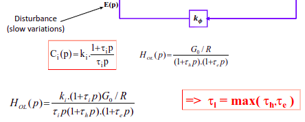

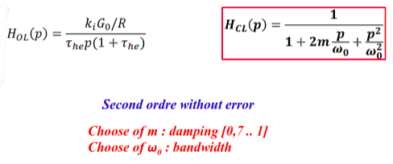

#### 5.3. Controle de la vitesse/ fonction de transfert de tension

##### Schema bloc et FT

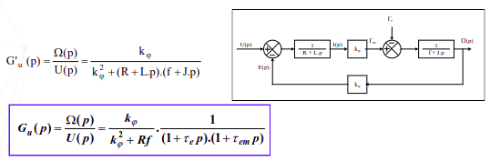

##### Schema synoptique

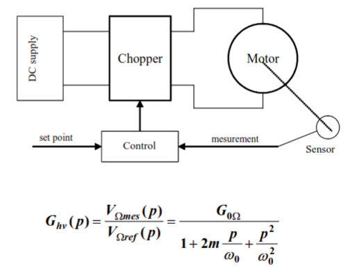

#### 5.4. Combinaison : boucles imbriquées

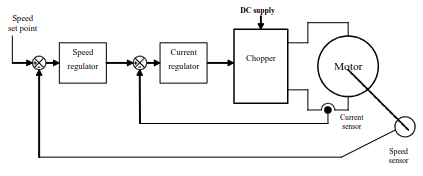

### 6. Hacheurs indirects : hacheurs basé sur le stockage d'energie

#### 6.1. Buck-Boost : hacheur à stockage inductif
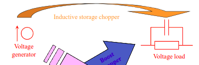  

##### Schema
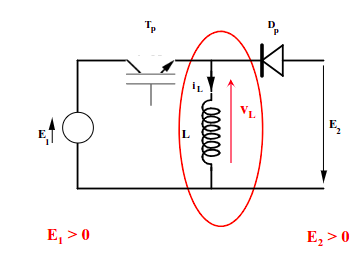

##### Mode de fonctionnement

- Mode continu : $i_L > 0$
- Mode limite : $i_L(T) = 0$
- Mode discontinue : $i_L(t_0) = 0$ avec $t_0 < T$

###### Mode continu

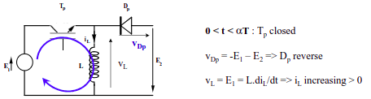

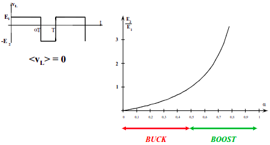
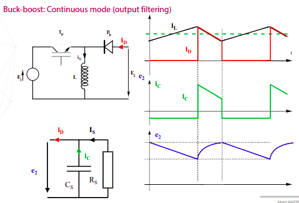
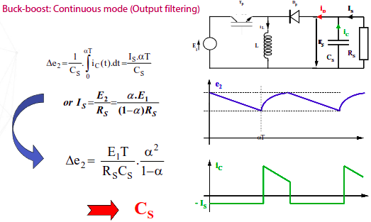
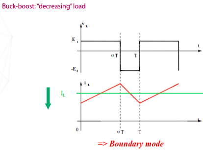

##### Mode limite

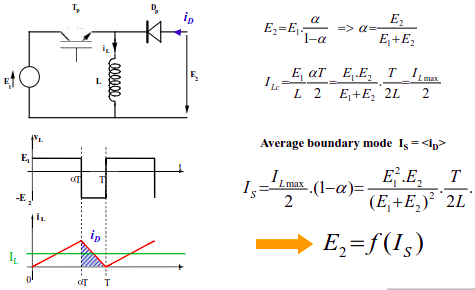

##### Mode discontinue

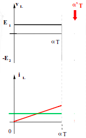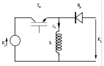

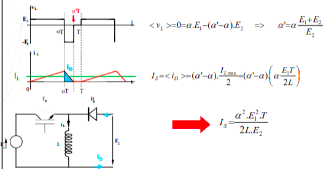

##### Caractéristique de sortie

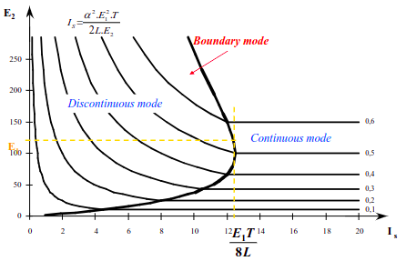

#### 6.2. Cuk : hacheur à stockage capacitif

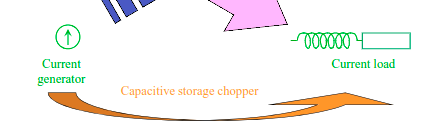

##### Schema

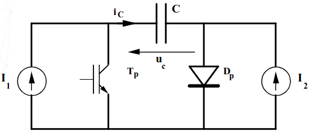

##### Mode de fonctionnement : continue ($U_c > 0$)

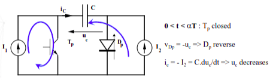
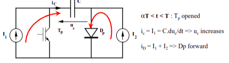

###### Chronogrammes

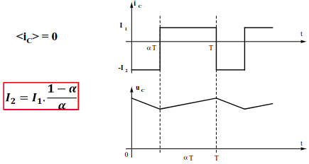

###### Caractéristique de transfert

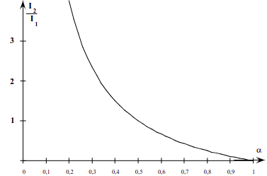

#### 6.3. SEPIC

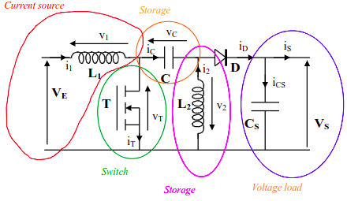

##### Mode continu 

###### Transfert de tension

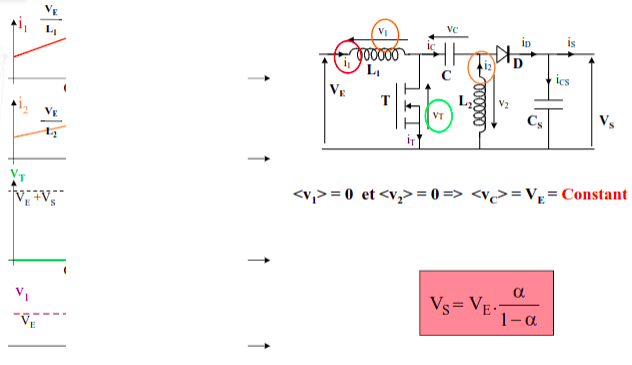

###### Condensateur de couplage

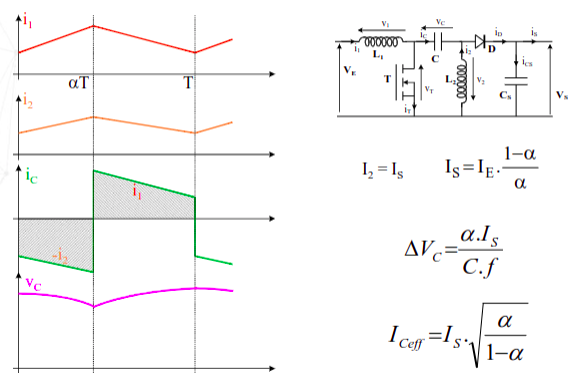

